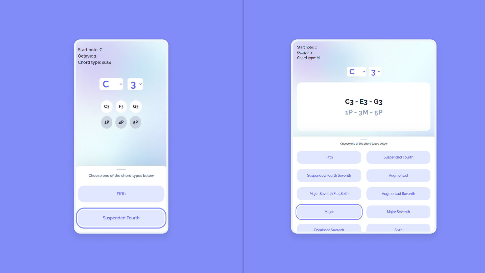

<div align="center">
  <br>
  <h1>Chordion</h1>
  <p>🎵 An easy reference for chord construction 🎵</p>
  <br>
  <p align="center">
    <a href="https://github.com/nadiannis/chordion/issues"></a>
  </p>
  <br>
    
  [**View the Website**](https://chordion.vercel.app)
</div>

## Table of Contents

- [Description](#description)
- [Tech Stack](#tech-stack)
- [Folder Structure](#folder-structure)
- [Run Locally](#run-locally)
- [Contributing](#contributing)
- [License](#license)

## Description

**Chordion** is a handy reference for chord construction. It can be your companion in practicing, playing a musical instrument, or making music. You can see the chord formula with the notes that make up the chord. You can also listen to the sound of the chord.

Choose a start note/ root note, octave, and chord type, then you can see the chord formula with the chord notes. When you select a chord type, you will also hear how the chord sounds.

<br>

<br>

<br>

## Tech Stack

- Language: [JavaScript](https://developer.mozilla.org/en-US/docs/Web/JavaScript)
- Frontend Library: [React 18](https://react.dev)
- State Management: [React Context-Provider Pattern](https://react.dev/learn/passing-data-deeply-with-context)
- Frontend Build Tool: [Vite](https://vitejs.dev)
- CSS Framework: [Tailwind CSS 3](https://tailwindcss.com)
- Music Theory Library: [tonal](https://github.com/tonaljs/tonal)
- Audio Library: [howler.js](https://howlerjs.com)
- Linter: [ESLint](https://eslint.org)
- Code Formatter: [Prettier](https://prettier.io)
- Git Hook: [Husky](https://github.com/typicode/husky)

## Folder Structure

```
.
├── public
├── src
│   ├── assets
│   ├── components
│   ├── context
│   ├── data
│   ├── hooks
|   ├── layouts
│   ├── utils
│   ├── App.jsx
│   ├── index.css
│   └── main.jsx
├── ...
├── index.html
├── ...
├── package.json
├── ...
├── README.md
├── tailwind.config.cjs
├── ...
.
```

## Run Locally

### Getting Started

- Make sure you have [Node.js](https://nodejs.org) and [Yarn](https://yarnpkg.com) installed on your computer.

- Clone the repo.

  ```bash
  git clone https://github.com/nadiannis/chordion.git
  cd chordion
  ```

- Install the dependencies.

  ```bash
  yarn
  ```

### Development

Run the development server.

```bash
yarn dev
```

### Production

Build the app.

```bash
yarn build
```

## Contributing

You can contribute to this project by creating an [issue](https://github.com/nadiannis/chordion/issues) or [pull request](https://github.com/nadiannis/chordion/pulls).

## License

This project is licensed under the MIT License - see the [LICENSE](https://github.com/nadiannis/chordion/blob/main/LICENSE) file for details.
